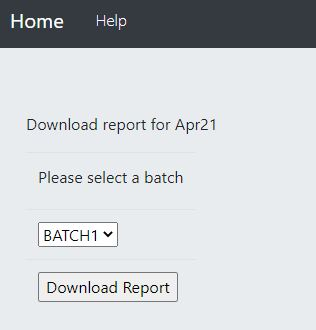
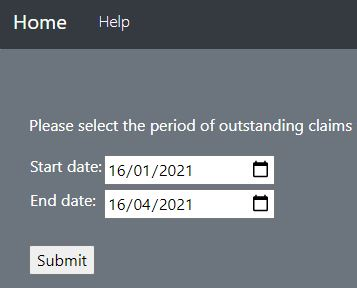
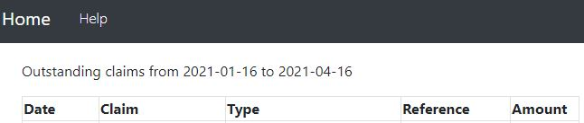
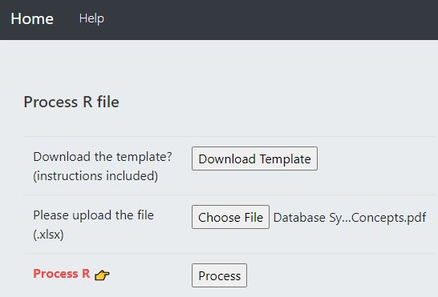
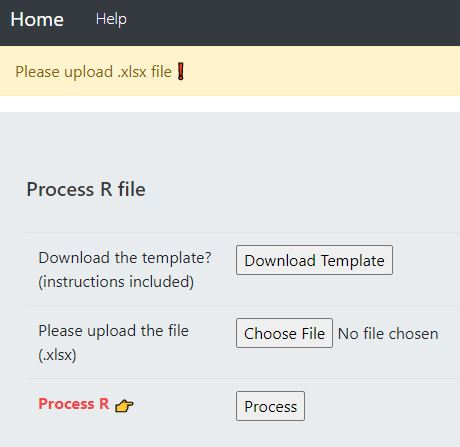
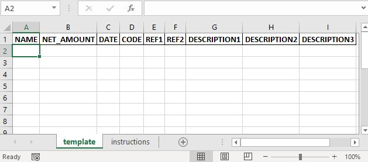

# Web application

This is a project that provides customized reports for finance purpose

## ALL INFORMATION WAS RE-CODED FOR SERCURITY PURPOSE

Report Y provides the option to download different batch reports with multiple reports in multiple workbooks. No files will be saved on the server, and data would be cleared as soon as the user downloads the report.

Claim report provides a list of outstanding claims for a date range specified by user. The default date range is three months.

Process R will process .xlsx file by automatically updating databases which will be captured by the accounting software. An Excel template can be downloaded for data entry with instuctions included. 

